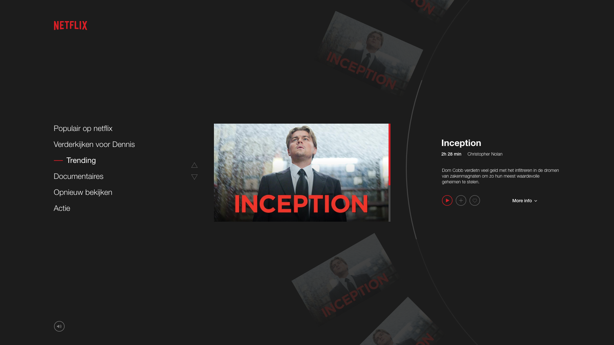

# Resn dev assignment

The result can be found [here](https://api.denniswegereef.nl/)

Had a lot of fun getting the freedom of turning something so simple that we almost use everyday to something more interesting. In this document, I describe a little what went through my head and the steps I took to get to the current result.

Tried to find a nice balance between how difficult I could make it for myself and the hours I got. So trying to challenge me but don't build the impossible without the certainty that's gonna work or ever end (what is also fun but really wanna deliver something that works also.

&nbsp;

## Concept

So started with a little research on what the current state of the Netflix carousel is. Made notes about the desktop and the mobile how they function and currently what they offer. After that, went looking for the obvious redesigns of a Netflix page on some inspirational websites to get familiar with it and look obviously for inspiration. Slowly that went to look at interesting takes on how a carousel could work other than just having a horizontal line of cards.

[The notes can be found here](https://www.notion.so/Resn-assignment-bbec14a274b84079950094225a730551).

Ended up with a concept that was based on the old film tapes where the carousel would rotate and had the tapes feel to it. So after some discussion with a couple of friends who are also working in the field, I just went with it and did not swing around with multiple ideas and don't pursue them. Made a design in Adobe XD just to get some visual perspective where I wanna go and what elements should be relevant. What was also important is that I tried to keep the visual look of Netflix as close as possible, but give my own twist.

&nbsp;

## Current stack

The stack that I've used:

**Nuxt.js** -> It's just nice to have everything working just from the start without spending too much time setting up the project. Also, I just enjoy writing Vue and separating the logic a little to each element. But I think for this project it wouldn't really matter that much if I would use for example the Vue CLI since I really don't need server-side stuff.

**Vuex** -> Well a no-brainer to manage states in Vue and well integrated with Nuxt.

**SCSS** -> For as long as I can remember I just use SCSS and the flexibility and had a nice setup already from older projects to help me get started.

**GSAP** -> For all the animation work GSAP was there for me, creating timelines in just a breeze is amazing. It's nice that it's all rendered on the exact frame and you really don't even have to think about it.

**GSAP Draggable** in combination with the **InertiaPlugin** -> I knew the Draggable existed and didn't have an opportunity to try it so far. This was a given chance because it fits so well with what I wanna achieve for my carousel idea. In the end, it was so easy to and building on top of it. And with the InertiaPlugin it had a little more velocity movement when rotating.

Also worth noting that I tried to use my own variation BEM-look-a-like for writing classes and use the same structure of writing elements across my project.

&nbsp;

## Process

I've built it across several days starting from Monday the 5th till Friday the 9th of October. Where I spent numerous hours in different sessions on it when I had some time to spare.

As already stated on top I kicked off Monday finding a nice concept and setting up the project. Firstly I tried to find an API for some Netflix data but in the end, I just made my own JSON file to have full control of it.
After that, the first step I took was to get my Ferris wheel working and placing all the films in the correct place with the right rotation. It was important than no matter where components are living the wheel is reactive and responds to data changing. I use the Vuex state manager for that to keep track of what was going on from and to every component.

On Wednesday I had everything kinda working correctly how I pictured in my head. Starting to hook in all the different state changes of the user and react to them with animations and such. What was important is that only the right elements were animating and avoiding overlapping timelines on elements.

Later in the week, it was building the last items such as the sound module, preloader (that isn't actually a preloader), the genre picker that doesn't work but gives a bit of context and body to the page. And all the small details and bug fixes that didn't work as expected. And figuring out how they should animate and react on the page that it looked a bit more polished and functional. Nonetheless, I would love to have made it also a bit more responsive but within the current scope that was abandoned.

The last day was more about tweaking up some things I wasn't happy about, but no major changes whatsoever.

&nbsp;

## Conclusion

Overall I'm quite happy how it turned out from my concept to a working product and how it was pictured in my head. That I took a different approach to create a carousel with an interesting spin, pun intended.
In terms of how the code was written, I think I did a good job on how modular it was built and all centered on the rotating piece.

But with something like this, the longer you're looking at it the more you start to notice that you wanna do things differently and change them. Of course, when you spend another several hours it could improve so much more but something like this is never done :).

&nbsp;

## Time spent
I kept track of the time I was working on it.

 __Monday__
* 12:30 - 14:30
* 17:00 - 20:00

 __Tuesday__
* 11:30 - 12:15
15:00 - 17:00
19:00 - 22:30

 __Wednesday__
* 11:00 - 12:00
* 16:00 - 18:00

 __Thursday__
* 10:00 - 12:30
* 12:45 - 13:30
* 14:30 - 16:20
* 20:00 - 22:00

 __Friday__
* 11:00 - 15:00

Approximately 25 hours and 30 minutes total

Thanks for Reading!
Dennis